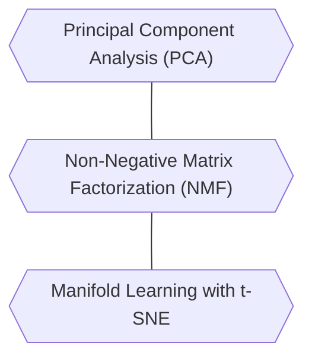

---
---

## Dimensionality reduction, Feature Extraction, and manifold Learning

### Principal Component Analysis (PCA)
<b>Principal componenet analysis</b> is a method that rotates the dataset in a way such that the rotated features are statistically uncorrelated. This rotation is often followed by selecting only a subset of the new features, according to how important they are for explaining the data.
We can use <b>PCA</b> for dimensionality reduction by retaining only some of the principal components.
<b>PCA</b> is used for feature extraction. The idea behind feature extraction is that it is possible to find a representation of your data that is better suited to analysis than the raw representation you were given.
### Non-Negative Matrix Factorization (NMF)
<b>Non-negative matrix factorization</b> aims to extract useful features. It works similarly to PCA and can also be used for dimensionality reduction.
In <b>NMF</b>, we want the components and the coefficients to be non-negative. Consequently, this method can only be applied to data where each feature is non-negative, as a non-negative sum of sum of non-negative components cannot become negative.
The process of decomposing data into a non-negative weighted sum is particularly helpful for data that is created as the addition (or overlay) of several independent sources, Example: audio track of multiple people speaking, music with many instruments.
<b>NMF </b>can identify the original components that make up the combined data.
### Manifold Learning with t-SNE
<b>Manifold</b> learning algorithms are mainly aimed at visualization, and so are rarely used to generate more than two new features. 
<b>t-SNE</b> compute a new representation of the training data, but don't allow transformations of new data.
These algorithms cannot be applied to a test set.
The idea behind <b>t-SNE</b> is to find a two-dimensional representation of the data that preserves the distances between pints as best as possible.
<b>t-SNE</b> puts more emphasis on points that are close by, preserve the information indicating which points are neighbors to each other.