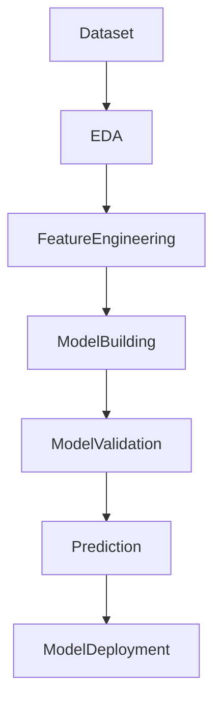

---
---

## Data Cleaning

## Imputation Techniques

#### Removing missing values
```python
dropna() # Drop missing value
dropna(how='all') # Drop observation where all cells are NA
dropna(axis=1, how='all') # Drop columns if all values are NA
dropna(thresh=5) # Drop rows that contain less than 5 non-missing values
fillna() # Replace missing values with zeros
fillna(value) # Replace missing values with value
fillna(other_column) # Borrows values from another column and replace with NA
isnull() # Returns True if the value is missing
notnull() # Returns True if the value is not missing
```


## Data Analysis and Visualization
#### ScatterPlot

#### Correlation
##### Pearson Correlation
$$
\Large{r = \dfrac{\sum(x-\bar{x})(y-\bar{y})}{\sqrt{\sum(x-\bar{x})^2\sum(y-\bar{y})^2}}}
$$
- Correlation is a bi-variate analysis that measures the strength of linear association between two variables and the direction of the relationship. 
- Correlation is statistical technique used to determine the degree to which two variables are linearly related.
![[Correlation.png]]


## Transformations
### Dummy Variables
#### get_dummies from pandas
```python
dataframe = pd.get_dummies(dataframe, columns=['lisit of columns'])
```
this will not keep the original column, for that purpose, use only one columns and do this
```python
new_dataframe = pd.get_dummies(dataframe['one column'])

datframe = pd.concat([dataframe, new_dataframe], axis=0)
```

### [[Feature Scaling]]
Some machine learning algorithms are sensitive to feature scaling means results will vary based on the units of the features so remove of the effect of scaling, it is required to go for feature scaling
- *StandardScaler*
- *RobustScaler*
- *MinMaxScaler*
- *Normalizer*

## Automatic EDA Libraries


#### Label Encoding
#### One Hot Encoding

## Isolation Forest for Outlier Detection
Methods for outliers detection
1. Boxplot
2. Histogram
3. Scatterplot
4. Q-Q plot
5. Empirical rules in normal distribution
6. Bar plot
7. Descriptive Statistics
8. Skewness long tail
9. Cook's Distance
10. DBScan clustering
11. Isolation Forest

Isolation Forest algorithm identify the outliers/ anomalies in **multidimensional space** 
Isolation forest is built based on decision trees

Step1: 
Step2:
Step3:
Step4:

## Predictive Power Score (PPS)
Correlation coefficient only check linear data. For non-linear association between data, PPS is used.
