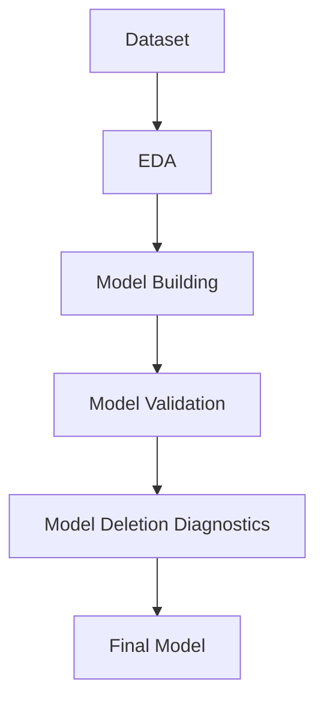

---
---

Data Visualization: Scatter Plot
Correlation Matrix
We compare p value with alpha value
if pvalue is greater than alpha value then that coefficient is not significant for analysis or not important for predicting y value
value of alphs is 0.05

There should not be high dependency in dependent variable

Collinearity:
When two or more than two independent variable have high or perfect correlation between them
VIF : Method used to solve multi collinearity problem
If VIF>20 it will create problem

choose one significant variable and discard other using R^2 and AIC value
R^2should increase and AIC decrease : we will choose that variable
For low AIC value ..less no. of column and more record are required.

Multile Linear Regression Model
Ordinary Least Square
Interpretation of Coefficients estimates
Basic tests
Assumptions
dataset --> EDA -- >Model building (Regression Equation)--> model Validation --> Model deletion diagnostic -- >final model
dataset
Model validation
P-value
R^2 valus
collinearity
residual analysis
Q-Q plot
error vs yi hat
error vs xi

model deletion diagnostic
Influencial points or outlier detection
cook's distance
leverage

We do model validation and model deletion dianostic and go back to data set by removing outliers and influencers then repeat again.

### Variation Inflation Factor (VIF):