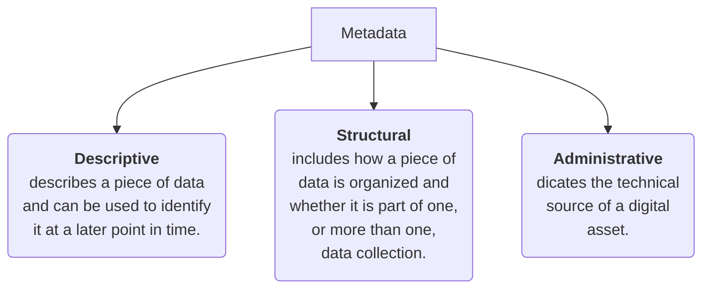

---
---

Data about data. Metadata is used in database management to help data analyst interpret the contents of the data within the database. Metadata creates a single source of truth by keeping things consistent and uniform. Metadata also makes data more reliable by making sure it’s accurate, precise, relevant, and timely.

3 common types of metadata:


Metadata repository: 
A database specifically created to store metadata. Metadata repositories make it easier and faster to bring together multiple sources for data analysis.
Metadata repositories:  
1. Describe the state and location of the metadata.
2. Describe the structures of the tables inside.
3. Describe how the data flows through the repository.
4. Keep track of who accesses the metadata and when.
Metadata is stored in a single, central location, and gives the company standardized information about all of it’s data.
---
Data Governance : A process to ensure the formal management of a company’s  data assets.

Primary key : An identifier that references a column in which each value is  unique.
1. Used to ensure data in a specific column is unique.
2. Uniquely identifies a record in a relational database table.
3. Only one primary key is allowed in a table.
4. Cannot contain null or blank values.

A primary key may also be constructed using multiple columns of a table. This type of primary key is called a composite key.

Foreign key : A field within a table that is a primary key in another table.
1. A column or group of columns in a relational database table that provides a link between the data in two tables.
2. Refers to a field in a table that’s the primary key of another table.
3. More than one foreign key is allowed to exist in a table.

Databases use a special language to communicate called a query language. Structured Query Language (SQL) is a type of query language that lets data analysts communicate with a database

Two basic types of data used by data analyst:
1. Internal data : Data that lives within a company’s own systems.
2. External data : Data that lives and is generated outside an organization.

Openness (or open data) : Free access, usage, and sharing of data.

Importing data from other spreadsheet:
1. Google Sheets:
	```
	=IMPORTRANGE("spreadsheet_url, range_string")
	```

Benefits of organizing Data :
1. Makes it easier to find and use.
2. Helps you avoid making mistakes during your analysis.
3. Helps to protect your data.

Best practices when organising data:\\
1. Naming Conventions : Consistent guidelines that describe the content, date, or version of a file in it's name. Use logical and descriptive names for your files to make them easier to find and use.
2. Foldering : Organise your files into folders. Break folders down into sub-folders.
3. Archieving older files : Move old projects to a separate location to create an archive and cut down on clutter.
4. Align your naming and storage practices with your team.
5. Develop metadata practices.

Think about how often you're making copies of data and storing it in different places because if data is stored in lots of different databases and spreadsheets, it can contradict itself and lead to mistakes later on. Also storing data in multiple places takes up a lot of space. Relational databases can help you avoid data duplication and store your data more efficiently.

File naming Do's :
1. Work out your conventions early.
2. Align file naming with your team.
3. Make sure file names are meaningful.
4. Keep file names short and sweet.
5. Format dates yyyymmdd: SalesReport20201125
6. Lead revision numbers with 0: SalesReport20201125v02
7. Use hyphens, underscores, or capitalized letters: SalesReport_2020_11_25_v02.

Data Security: Protecting data from unauthorized access or corruption by adopting safety measures.
Encryption uses a unique algorithm to alter data and make it unusable by users and applications that don’t know the algorithm.
Tokenization replaces the data elements you want to protect with randomly generated data referred to as a “token.” The original data is stored in a separate location and mapped to the tokens.

A professional online presence can :
1. Help potential employers find you.
2. Make connections with other analysts.
3. learn and share data findings.
4. Participate in community events.

Networking : Professional relationship building.
1. Search for public meetups in your area.
2. Follow interesting companies or taught leaders on Linkdln, Twitter, Facebook, or Instagram.
3. podcast: Partially Derivative, O'Reilly Data Show
4. Online community: O'Reilly, Kaggle, KDnuggets, GitHub, Medium

Mentors: A professional who shares their knowledge, skills, and experience to help you develop and grow. A mentor helps you skill up. 
1. SCORE.org
2. MicroMentor.org
3. Mentorship

Sponsor: A professional advocate who's committed to moving a sponsee's career forward within an organization. A sponsor helps you move up.