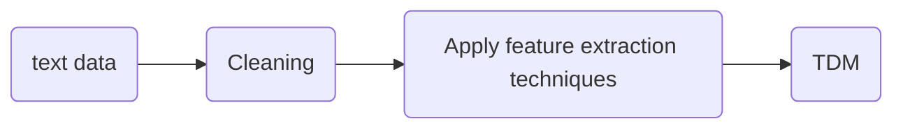

---
---

Discovering people opinions, emotions and feelings about a product or service

Transforming text into data structures

Tokenization
- Breaking the documents or sentences into chunks called tokens.

VSM (Vector Space Model): Text Preprocessing
- Before TDM, documents from corpus need to be preprocessed
- Objective: to reduce set of words to those are expected to be most relevant
- Preprocessing includes
	- Normalizing text
	- Removing high and low frequency terms
	- Removing stop words
	- Removing root/stem (lemmatization)

##### Normalizing the text
- Objective: transform various forms of same word to common, normalized form
- E.g. Apple, APPLE, apple --> apple
- How it is done?
	- Remove punctuation marks (dots, dashes, commas...)
	- Transform all words to lower case
	- Using online dictionary replace synonyms

##### Removing high and low frequency terms

##### Removing stop word
- Stop words are words which do not bear any information/meaning
- E.g. "this is not a good option" --> "option"
		"to be or not to be" --> null

##### Lemmatization

### Feature Extraction
- Binary Extraction
- Exploring the bags of words
- TF-IDF vectors
- N-grams

##### Vector Space Model
- Generalization of Bag of Space Model
- Each document from corpus is represented as multi-dimensional vector

##### Binary weights
weights take value 0 or 1 to reflect the presence or absence of term in document

##### Bag of Words
- Consider text as simple set of words
- Based on following (unrealistic) assumptions
	- words are mutually independent
	- word order in text is irrelevant

##### TF-IDF
$$weight(w,d) = TF(w,d)\times IDF(w)$$

### Sentiment Analysis
#### Emotional Lexicons
