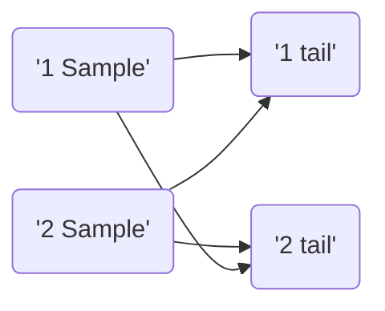

---
---

Science of data.

#### [[Descriptive Statistics]]
- Organizes and makes sense of data
- Uses Numerical and Graphical Methods
- Identifies patterns in data
- Isolates and summarizes key information
- Simplifies the information focusing on the items of interest
- Eliminates undesired information to avoid information overload
- understand and communicate aspects of data

#### [[Inferential Statistics]]
- Draws conclusion about population from given information about a representative sample
- And uses this information in good decision making

#### [[Probability]]
## Random Variable & Probability

#### Random Variable
A random variable describes the probabilities for an uncertain future numerical outcome of random process.
	- Discrete Random Variable
	- Continuous Random Variable

### Z-Scores

z-score makes use of the mean and standard deviation of the data set in order to specify the relative location of the measurements.

It represents the distance between a given data point and the mean 

- Large z scores tells us that measurement is larger than almost all other measurements in the dataset
- Similarly, a small tells us


### [[Probability distributions]]
- Continuous Probability distributions

- Discrete Probability distributions


### Central Limit Theorem
Distribution of data in population is normal.

### Confidence Interval
As range/interval increases, confidence increases

### Interval Estimate
$\bar{x}\pm z_{1-\alpha} \frac{\sigma}{\sqrt{n}}$ where $z_{1-\alpha}$ satisfies $P$
interval estimate = point estimate $\pm$ Margin of error


### Variants of t-test

If sample variance is given, not the population variance then use t-test
$$t=\frac{\bar{x}-\mu}{s/\sqrt{n}}$$
for 1 tail, p-value is:
```python
1-stats.t.cdf(t_value,degrees_of_freedom)
```
for 2 tails, p-value is:
```python
stats.t.cdf(-t_value,degrees_of_freedom)
```
