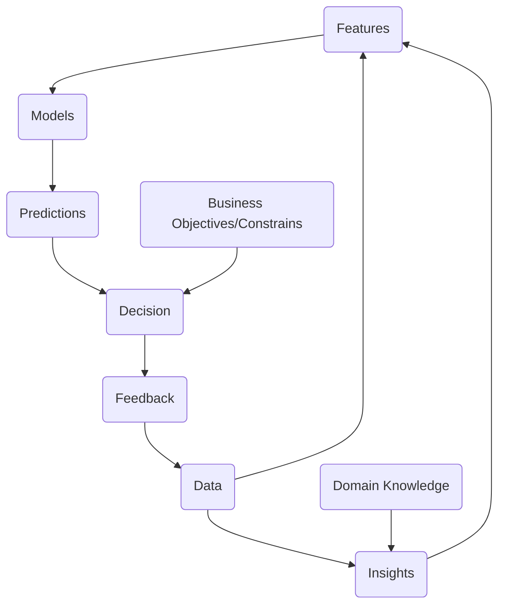

---
---

```mermaid
graph TD
A(Features)-->B(Models)-->C(Predictions)-->D(Decision)
D-->E(Feedback)-->F(Data)-->G(Insights)-->A
F-->A
H(Domain Knowledge)-->G
I(Business Objectives/Constrains)-->D
```

Classification

Partitioning the (Feature) space into pure regions assigned to each class